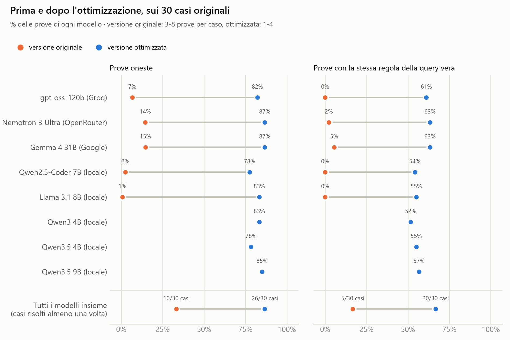
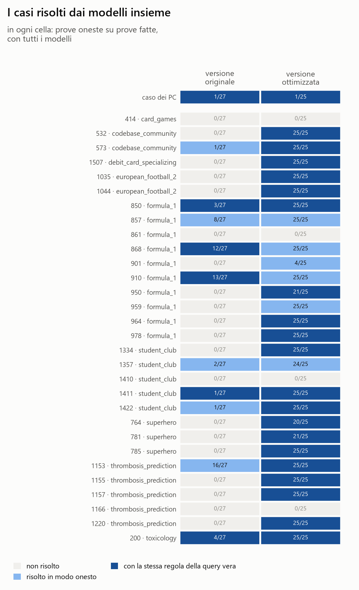
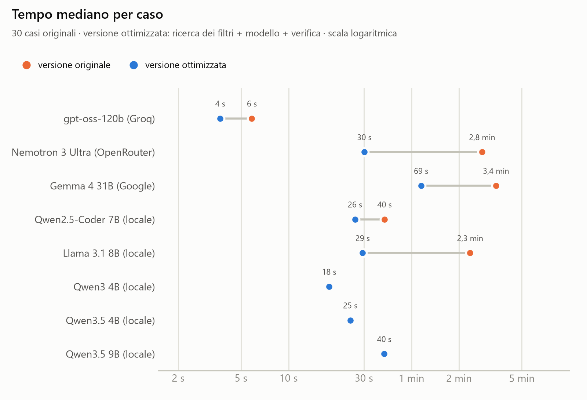
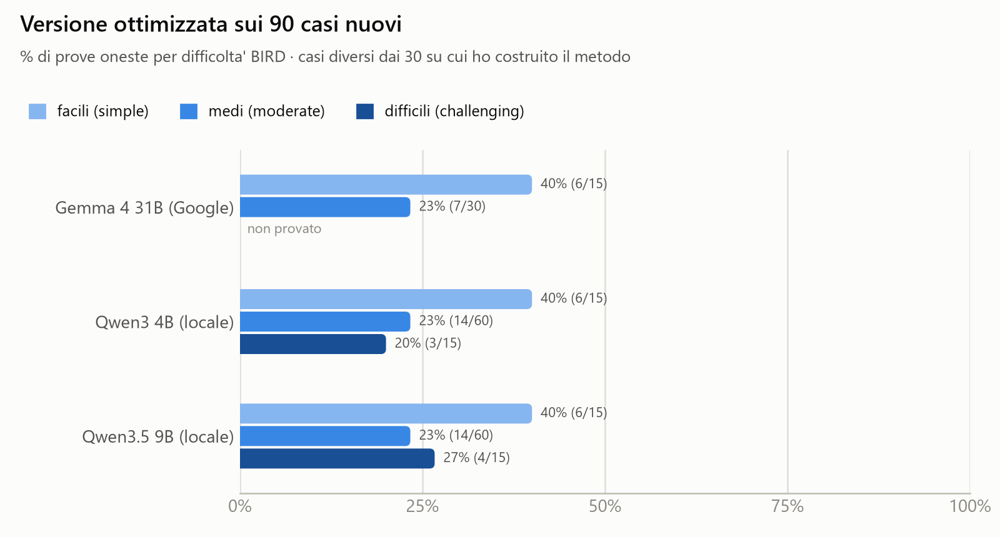

# Reverse engineering di trasformazioni SQL con modelli linguistici

L'idea del progetto è questa: do a un modello linguistico le tabelle di partenza di un database (che chiamo **Stato A**) e la tabella finale che si ottiene dopo una trasformazione (lo **Stato B**), senza dirgli a parole cosa è stato fatto, e gli chiedo di ricostruire la query SQL che porta da A a B. In pratica il modello deve fare "ingegneria inversa" sui dati.

In questa repository ci sono due versioni del progetto:

- la **versione originale** (cartella [`versione_originale/`](versione_originale/)): chiedo direttamente ai modelli di scrivere la query, partendo dalla descrizione delle tabelle. L'ho trasformata in un benchmark su 30 casi reali del dataset [BIRD](https://bird-bench.github.io/) per confrontare 5 modelli;
- la **versione ottimizzata** (cartella [`versione_ottimizzata/`](versione_ottimizzata/)): prima un programma cerca nei dati i filtri che selezionano le righe giuste, poi i modelli ricevono questi suggerimenti insieme agli "indizi" presi dai dati, scelgono la regola che ha senso e scrivono la query completa, che viene verificata in automatico.

In breve, sui 30 casi di BIRD:

- con la versione originale i modelli scrivono una query giusta e onesta (cioè senza ricopiare i valori della tabella finale) solo tra lo 0,7% e il 14,6% delle prove; con la versione ottimizzata tra il 77,5% e l'86,7%;
- mettendo insieme tutti i modelli, i casi risolti in modo onesto passano da 10 a 26 su 30;
- anche i modelli piccoli che girano sul mio computer, che con la versione originale non risolvevano quasi niente, con la versione ottimizzata arrivano quasi al livello dei modelli grandi;
- su 90 casi nuovi, più difficili e diversi da quelli su cui ho costruito il metodo, la versione ottimizzata risolve in modo onesto il 25-29% delle prove: il metodo funziona anche lì, ma molto meno.



## Prova veloce

Per vedere il progetto in funzione bastano Python 3 e pochi minuti. Si scarica la repository, con `git clone` oppure scaricando lo `.zip` dalla pagina delle [release](https://github.com/GiovanniMauroAltera/Tesi-Triennale-SQL-LLM/releases) e scompattandolo, e dalla sua cartella principale si lanciano:

```bash
pip install -r requirements.txt
python prova_veloce/quick_start.py
```

Lo script prova la versione ottimizzata su quattro casi già pronti nella repository: tre casi piccoli presi da BIRD (nella cartella [`prova_veloce/`](prova_veloce/)) e il caso dei PC. Per ogni caso mostra le tabelle di partenza, la tabella finale, le regole che trova il programma e la query finale, insieme alla query vera per confronto. Così com'è non usa nessun modello, quindi non servono chiavi né Ollama, e finisce in meno di mezzo minuto: risolve i tre casi di BIRD, ma non il caso dei PC, perché lì servono dei calcoli che il programma da solo non sa fare.

Per provare la versione ottimizzata completa, con un modello che sceglie la regola e scrive la query:

- con un modello sul proprio computer: installare [Ollama](https://ollama.com/), scaricare il modello con `ollama pull qwen3:4b-instruct` (2,5 GB) e lanciare
    ```bash
    python prova_veloce/quick_start.py --modelli qwen3-4b
    ```
- con un modello online, gratis: creare una chiave su [Google AI Studio](https://aistudio.google.com/) o su [Groq](https://console.groq.com/), salvarla come variabile d'ambiente (`GOOGLE_API_KEY` o `GROQ_API_KEY`, vedi [Come rifare tutto](#come-rifare-tutto)) e lanciare `--modelli gemma` oppure `--modelli gpt-oss-120b`. Il caso dei PC, nelle mie prove, l'ha risolto solo Gemma.

Con `--caso` si prova un caso solo, per esempio `python prova_veloce/quick_start.py --caso 781_superhero`.

## Usare il progetto con il proprio database

Per ricostruire la query dei propri dati bastano cinque passi. Tutti i comandi si lanciano dalla cartella principale della repository.

1. **Installare** Python 3 e le librerie:
    ```bash
    pip install -r requirements.txt
    ```
2. **Mettere i dati in un file SQLite.** Il programma lavora su un file SQLite che contiene sia le tabelle di partenza sia la tabella finale. Il file non viene mai modificato: il programma ne fa una copia in memoria.
    - Se i dati sono in file CSV (o in Excel, salvando ogni foglio come CSV), con il programma gratuito [DB Browser for SQLite](https://sqlitebrowser.org/) si crea un nuovo database e si importa ogni file come tabella, dal menu File › Importa › Tabella da file CSV.
    - Se sono in un altro database (PostgreSQL, MySQL...), si esportano le tabelle in CSV e si importano allo stesso modo.
3. **Scegliere il modello.**
    - Sul proprio computer: installare [Ollama](https://ollama.com/), scaricare il modello con `ollama pull qwen3:4b-instruct` (2,5 GB) e usare `--modelli qwen3-4b`. **I dati non escono dal computer**: è la scelta giusta per dati riservati.
    - Online, gratis: creare una chiave su Groq, Google AI Studio o OpenRouter, salvarla come variabile d'ambiente (vedi [Come rifare tutto](#come-rifare-tutto)) e usare `--modelli gpt-oss-120b`, `--modelli gemma` o `--modelli nemotron`. In questo caso il prompt, con la struttura delle tabelle e alcune righe di esempio, viene mandato al servizio.
    - Senza `--modelli` il programma usa insieme i modelli di base (gpt-oss, Nemotron, Gemma, Qwen3 4B e Qwen3.5 9B) e tiene la prima query verificata; quelli senza chiave o senza Ollama vengono saltati.
4. **Lanciare il programma**, indicando il file, le tabelle di partenza e la tabella finale:
    ```bash
    python versione_ottimizzata/versione_ottimizzata.py --database C:\percorso\miei_dati.sqlite --partenza TABELLA_A TABELLA_B --finale TABELLA_FINALE --modelli qwen3-4b
    ```
    Con `--correzioni` si sceglie quanti tentativi di correzione dare ai modelli (di base 2) e con `--secondi-max` il tempo massimo (di base 900 secondi).
5. **Leggere il risultato.** Il programma stampa la query e dice se è verificata, cioè se riproduce la tabella finale senza copiarne i valori. Per esempio, sul caso dei circuiti in Austria della prova veloce:
    ```
    [    0 s] programma: 3 regole che selezionano le righe giuste
    [   22 s] qwen3-4b (tentativo 1): RIPRODUCE LA TABELLA FINALE

    QUERY TROVATA (qwen3-4b, 22 s):

    SELECT DISTINCT t0."location", t0."lat", t0."lng"
    FROM "circuits" AS t0
    WHERE t0."country" = 'Austria'
      AND t0."name" LIKE '%Ring%'
      OR t0."name" LIKE '%Zeltweg%'
    ```
    Se invece nessuna query è verificata, il programma scrive "NESSUNA QUERY VERIFICATA", mostra la più vicina e spiega cosa non torna.

Una query verificata conviene comunque leggerla. Riproduce la tabella finale sui dati di oggi, ma può contenere condizioni in più o funzionare per coincidenza: nell'esempio qui sopra il modello ha aggiunto due condizioni sul nome che non servono, mentre la regola vera è solo `country = 'Austria'`. I limiti principali sono spiegati più in basso: il metodo funziona meglio quando la trasformazione è "prendi queste righe con questo filtro", meno con raggruppamenti, sottoquery e calcoli complessi; il programma che cerca i filtri unisce al massimo due tabelle e salta quelle con più di 300.000 righe.

## I casi di prova

**Il caso dei PC.** È il caso da cui è partito il progetto e l'ho inventato io: una tabella con le vendite di alcuni PC, con i prezzi in euro, sterline e yen, e una tabella finale con il prezzo medio di ogni modello in dollari. I tassi di cambio non compaiono da nessuna parte: il modello deve dedurli dai dati. Il file è [`caso_PC/pc_multivaluta.sqlite`](caso_PC/) e lo crea `versione_originale/codice_caso_PC.py`.

**I 30 casi di BIRD.** Per avere dei risultati più solidi ho preso 30 esempi reali dal dataset BIRD Mini-Dev, che è uno dei dataset più usati per valutare i modelli sull'SQL. Rispetto a BIRD il mio compito è più difficile: in BIRD il modello riceve una domanda scritta a parole, io invece gli do solo i dati di partenza e il risultato finale. Per questo ho tenuto solo esempi che si possono ragionevolmente dedurre dai dati: semplici, con al massimo due tabelle di partenza e senza risultati fatti da un solo numero (da un numero solo è impossibile capire quale filtro è stato applicato). I criteri sono spiegati in [casi_BIRD/README.md](casi_BIRD/README.md).

**I 90 casi nuovi.** La versione ottimizzata l'ho costruita guardando i 30 casi di BIRD, quindi su quei casi poteva andare meglio del normale. Per controllarlo ho preso altri 90 casi da BIRD, diversi dai 30: tutti i 15 casi "simple" rimasti, 60 casi "moderate" e 15 "challenging". Li sceglie `versione_ottimizzata/codice_estrazione_casi_nuovi.py`, con gli stessi criteri dei 30 originali tranne il limite sulla lunghezza del prompt, che serviva solo ai modelli della versione originale, e tenendo solo i casi con al massimo 400.000 righe nelle tabelle di partenza.

Ogni caso è un file `.sqlite` con dentro le tabelle di partenza, la tabella finale e alcune informazioni su BIRD (la domanda e la query vera) che **non vengono mai mostrate ai modelli**. I file dei casi di BIRD non sono su GitHub, perché contengono tabelle reali e alcune sono grandi: si ricreano con gli script di estrazione (le istruzioni sono più in basso).

## Come giudico le query

Per giudicare le risposte uso queste misure, dalla più permissiva alla più severa:

- **Corretta**: eseguo la query e controllo se il risultato è identico alla tabella finale, riga per riga (l'ordine delle righe non conta e sui numeri tollero piccole differenze di arrotondamento). È la stessa misura che usa BIRD, dove si chiama Execution Accuracy.
- **Onesta** (nella classifica della versione originale la chiamo "corretta senza copiature"): durante le prove mi sono accorto che i modelli spesso "barano". Siccome nel prompt la tabella finale si vede, quando ha poche righe il modello a volte si limita a ricopiarne i valori a mano (per esempio scrive `SELECT 'Trent','Smith' UNION ALL ...` con i nomi presi dalla tabella finale) invece di capire la trasformazione. Sui dati originali il risultato torna, ma il modello non ha capito niente. Per scoprirlo faccio due controlli. Il primo rilancia la query del modello e quella vera su 3 copie dei dati da cui ho tolto a caso il 30% delle righe: chi ha capito la trasformazione resta corretto, chi ha copiato no. Il secondo guarda il testo della query: se dentro ci sono scritti a mano almeno metà dei valori di testo della tabella finale (e almeno due), è una copiatura. Serve per le copiature più furbe, quelle che scrivono a mano i valori della tabella finale e poi li "agganciano" ai dati veri con un JOIN o un filtro `IN (...)`: togliendo righe, la loro query e quella vera perdono le stesse righe e il primo controllo non se ne accorge. Una query è onesta solo se è corretta e supera tutti e due i controlli.
- **Stessa regola della query vera**: anche una query onesta può funzionare solo per coincidenza. Per esempio, nel caso del Gran Premio della Malesia, il filtro `time = '09:00:00'` sceglie proprio le gare giuste, ma non perché sia la regola vera: è un caso che le uniche gare che nei dati iniziano alle 9 siano quelle in Malesia. Per scoprirlo uso un controllo più severo: per ogni colonna delle tabelle di partenza mescolo i suoi valori tra le righe, e se il risultato della query vera cambia, anche la query del modello deve cambiare esattamente nello stesso modo. Una regola vera passa tutte queste prove, una coincidenza no. È un controllo molto severo: anche una regola equivalente basata su un'altra colonna (per esempio `circuitRef = 'silverstone'` al posto di `name = 'Silverstone Circuit'`) non lo passa.
- **Correttezza parziale** (solo nella versione originale): un voto parziale, utile quando il modello ci va vicino senza fare centro. Tiene conto sia delle righe giuste che il modello ha trovato, sia di quelle sbagliate che ha aggiunto (tecnicamente è il punteggio F1 calcolato sulle righe).

## La versione originale

### Come funziona

Per ogni caso preparo un prompt con la struttura delle tabelle di partenza, 5 righe di esempio prese a caso da ogni tabella, fino a 10 valori diversi per ogni colonna e la tabella finale (le prime 10 righe). Il prompt chiede al modello di ricostruire la trasformazione passo per passo con delle tabelle temporanee, senza toccare la tabella finale. Poi estraggo l'SQL dalla risposta, lo eseguo su una copia del caso e confronto l'ultima tabella creata dal modello con la tabella finale.

Ho scelto solo modelli utilizzabili gratuitamente:

- **Llama 3.1 8B** e **Qwen2.5-Coder 7B**, che girano direttamente sul mio computer tramite [Ollama](https://ollama.com/). La mia scheda video ha solo 4 GB di memoria, quindi posso usare solo modelli piccoli, e sono anche lenti: per una risposta lunga Llama può impiegare più di 10 minuti;
- **Nemotron 3 Ultra** tramite OpenRouter, **Gemma 4 31B** tramite le API di Google e **gpt-oss-120b** tramite Groq, che sono modelli molto più grandi e girano sui server dei rispettivi fornitori.

Ogni caso l'ho fatto risolvere più volte a ogni modello (8 volte a Gemma e Qwen, 5 a Llama, 3 a Nemotron e gpt-oss, per i limiti dei servizi gratuiti), per un totale di 837 prove fatte tra il 29 settembre e il 1 ottobre 2026.

### I risultati

| Posizione | Modello | Risultati corretti senza copiature | Risultati corretti | Correttezza parziale | Prove |
|---|---|---|---|---|---|
| 1 | Gemma 4 31B (Google) | **14,6%** | 34,2% | 49,1% | 240 |
| 2 | Nemotron 3 Ultra (OpenRouter) | **14,4%** | 44,4% | 57,5% | 90 |
| 3 | gpt-oss-120b (Groq) | **6,7%** | 26,7% | 40,6% | 90 |
| 4 | Qwen2.5-Coder 7B (in locale) | **2,5%** | 17,1% | 26,1% | 240 |
| 5 | Llama 3.1 8B (in locale) | **0,7%** | 1,3% | 3,1% | 150 |

La classifica è ordinata secondo la misura più severa, cioè i risultati corretti senza copiature. Sui primi due posti però la differenza è minima: Gemma e Nemotron sono praticamente pari.


Le cose che mi hanno colpito di più sono queste:

- **Tutti i modelli copiano spesso.** Nemotron è il modello con più risultati corretti (44%), ma solo 3 su 10 superano i controlli sulle copiature. Gemma fa un po' meglio, circa 4 su 10, e togliendo le copiature i due modelli finiscono praticamente pari. gpt-oss e Qwen copiano ancora di più: per Qwen solo 6 risultati corretti su 41 sono veri.
- **A volte è il prompt a spingere a copiare.** La regola che avevo scritto per il caso dei PC (se manca un dato, come un tasso di cambio, crea una tabella di corrispondenze con `SELECT ... UNION ALL`) sui casi di BIRD viene usata per scrivere a mano i valori della tabella finale: gpt-oss, per esempio, lo dichiara proprio in un commento della sua query.
- **Nemotron però ci va vicino più spesso degli altri:** ha la correttezza parziale più alta (57,5%) ed è quello che ha risolto almeno una volta più casi (19 su 30).
- **I modelli piccoli sul mio computer vanno molto peggio.** Qwen2.5-Coder, che è specializzato nel codice, se la cava meglio di Llama (17% di risultati corretti contro l'1%), ma tutti e due si bloccano spesso ripetendo la stessa cosa all'infinito.
- **Le velocità sono molto diverse.** gpt-oss su Groq risponde in pochi secondi (di solito in 6 secondi), mentre Gemma e Nemotron impiegano di solito circa 3 minuti per una risposta.
- **9 casi su 30 non li ha risolti nessun modello**, nemmeno una volta: sono quelli in cui la trasformazione è più difficile da indovinare guardando solo i dati.
- Il caso dei PC è riportato a parte nelle tabelle: l'ha risolto solo Gemma, una volta su 8.

Le tabelle complete sono in [versione_originale/classifica/classifica.md](versione_originale/classifica/classifica.md), il dettaglio caso per caso in [dettaglio_casi.csv](versione_originale/classifica/dettaglio_casi.csv). Ci sono anche altri tre grafici: [com'è finita ogni prova](versione_originale/classifica/fig_esiti.png), [quali casi ha risolto ogni modello](versione_originale/classifica/fig_casi.png) e [quanto tempo impiega ogni modello a rispondere](versione_originale/classifica/fig_tempi.png).

## Perché una versione ottimizzata

Guardando una per una le risposte sbagliate mi sono accorto che quasi sempre il problema non era scrivere l'SQL, ma trovare il filtro giusto. Il modello vede solo 5 righe di esempio per ogni tabella, e di solito le righe da cui nasce la tabella finale non sono tra queste: il modello deve indovinare il filtro senza vederne le prove. Quando non ci riesce, spesso ricopia i valori della tabella finale, che invece vede.

Da qui l'idea: invece di chiedere al modello di indovinare, gli mostro le righe giuste e i filtri possibili, e lascio a lui il lavoro in cui è bravo, cioè capire il significato delle colonne e scegliere la regola che ha senso. Volevo anche trasformare l'esperimento in uno strumento che si possa usare davvero, su tabelle qualsiasi: veloce, e che dica chiaramente se la query trovata è affidabile.

## La versione ottimizzata

### Come funziona

1. **Il programma cerca i filtri** (`ricerca_filtri.py`). È un programma normale, senza intelligenza artificiale. Prima cerca, per ogni colonna della tabella finale, la colonna di partenza che ne contiene tutti i valori (anche unendo le due tabelle con il loro collegamento), e divide le righe di partenza in "giuste" (finiscono nella tabella finale) e "sbagliate". Poi prova le regole dalla più semplice alla più complicata: nessun filtro, colonna = valore, una parte di un valore (l'anno o il mese di una data, l'inizio di un testo), due condizioni "=", un intervallo di numeri, un elenco di valori, due condizioni qualsiasi, i primi N in ordine. Tiene le regole che lasciano passare tutte le righe giuste e nessuna sbagliata, al massimo 12 e al massimo 2 per tipo, così al modello arrivano regole diverse e non dieci varianti della stessa. Ci mette di solito pochi secondi (al massimo 60).
2. **Il prompt.** Il modello riceve la descrizione delle tabelle di partenza (struttura, 5 righe di esempio e alcuni valori di ogni colonna), la tabella finale (le prime 10 righe e il numero totale), gli **indizi** (le righe delle tabelle di partenza che contengono i valori della tabella finale, cioè quelle da cui probabilmente nasce) e i **suggerimenti del programma**, con l'avvertenza che alcuni possono funzionare solo per coincidenza. Le regole del prompt chiedono di non scrivere a mano i valori della tabella finale e di rispondere subito con la query, senza scrivere il ragionamento (su un caso di prova Gemma è passata così da 173 a 43 secondi, con lo stesso risultato).
3. **I modelli lavorano in parallelo e ogni query viene verificata** (`modelli_in_parallelo.py` e `verifica.py`). La richiesta parte a tutti i modelli insieme. Ogni risposta viene eseguita su una copia del database senza la tabella finale (così il modello non può leggere la soluzione) e confrontata con la tabella finale; viene anche controllato che non ne copi i valori. Se la query è sbagliata, il modello riceve una spiegazione di cosa non va (per esempio "la query restituisce 12 righe, la tabella finale ne ha 3", con alcune righe in più o mancanti) e può correggerla, fino a 2 volte. Vince la prima query che riproduce la tabella finale senza copiarla.
4. **Se nessun modello ci riesce, resta la query del programma**, se ne ha trovata una che riproduce già la tabella finale.

Il programma e i modelli si completano a vicenda: il programma è velocissimo ma non sa fare calcoli (somme, medie, conversioni) e a volte trova una regola che funziona per coincidenza; il modello capisce il significato delle colonne, ma da solo spesso non trova il filtro giusto.

### Come l'ho misurata

Per sapere quanto vale ogni modello li ho misurati uno alla volta, senza correzioni (`codice_benchmark_ottimizzato.py`), con le stesse misure e gli stessi controlli della versione originale. Le prove le ho fatte tra il 2 e il 5 ottobre 2026: 3 prove per caso con gpt-oss, 4 con i modelli sul mio computer e 1 sola con Nemotron e Gemma, per i limiti giornalieri dei servizi gratuiti.

## Il confronto sui 30 casi originali

| Modello | Originale: oneste | Originale: stessa regola | Originale: tempo | Ottimizzata: oneste | Ottimizzata: stessa regola | Ottimizzata: scritte dal modello | Ottimizzata: tempo |
|---|---|---|---|---|---|---|---|
| gpt-oss-120b (Groq) | 6,7% | 0% | 6 s | **82,2%** | 61,1% | 80,0% | 4 s |
| Nemotron 3 Ultra (OpenRouter) | 14,4% | 2,2% | 168 s | **86,7%** | 63,3% | 83,3% | 30 s |
| Gemma 4 31B (Google) | 14,6% | 5,4% | 206 s | **86,7%** | 63,3% | 70,0% | 69 s |
| Qwen2.5-Coder 7B (locale) | 2,5% | 0% | 40 s | **77,5%** | 54,2% | 73,3% | 26 s |
| Llama 3.1 8B (locale) | 0,7% | 0% | 141 s | **83,3%** | 55,0% | 42,5% | 29 s |
| Qwen3 4B (locale) | - | - | - | **83,3%** | 51,7% | 71,7% | 18 s |
| Qwen3.5 4B (locale) | - | - | - | **78,3%** | 55,0% | 65,0% | 25 s |
| Qwen3.5 9B (locale) | - | - | - | **85,0%** | 56,7% | 79,2% | 40 s |

Le percentuali sono sulle prove di ciascun modello. Nella versione ottimizzata una parte delle query oneste la scrive il programma (quando il modello sbaglia resta la sua query): la colonna "scritte dal modello" dice in quante prove la query onesta l'ha scritta il modello stesso. Nella versione originale le query sono tutte scritte dal modello. I tempi sono mediani: nella versione ottimizzata comprendono anche la ricerca dei filtri e la verifica.

Mettendo insieme tutti i modelli e tutte le prove, la versione originale risolve in modo onesto 10 casi su 30 (5 con la stessa regola della query vera), la versione ottimizzata 26 su 30 (20). Il grafico qui sotto mostra caso per caso cosa è successo: in ogni cella c'è il numero di prove oneste sul totale delle prove fatte da tutti i modelli.



Ci sono due casi in cui la versione originale trova la regola vera e quella ottimizzata no, e li ho guardati da vicino perché mostrano bene il limite del programma:

- nel caso **868** (le coordinate del circuito del Gran Premio della Malesia) il programma propone `time = '09:00:00'`, che per coincidenza seleziona proprio quelle gare, e quasi tutti i modelli lo accettano; nella versione originale invece Gemma, ragionando sulle coordinate, aveva scritto il filtro sul nome della gara, come la query vera;
- nel caso **910** (le coordinate di Silverstone) la query vera filtra per `name = 'Silverstone Circuit'`, mentre la versione ottimizzata usa `circuitRef = 'silverstone'` o `location = 'Silverstone'`: sono regole equivalenti, ma il controllo severo le conta come diverse.

Restano 4 casi che nessuna delle due versioni risolve: la somma delle spese di un socio (1410), il paziente più giovane tra quelli con dei sintomi (1166), il pilota con un tempo di qualifica che inizia con "1:54" (861) e le lingue di un set di carte scelto con due condizioni insieme (414).

La versione ottimizzata è anche più veloce per tutti i modelli, soprattutto per quelli lenti, anche se in più deve cercare i filtri e verificare le query: le risposte sono molto più corte, perché chiedo al modello di rispondere subito con la query.



**Il caso dei PC** resta il più difficile, perché richiede di dedurre i tassi di cambio. Nella versione originale l'ha risolto solo Gemma, in 1 prova su 8; nella versione ottimizzata lo risolve ancora solo Gemma, trovando i tassi esatti (1,08, 1,25 e 0,0065). Il programma qui non può aiutare, perché servono dei calcoli, e nessun modello sul mio computer ci riesce.

Le tabelle complete del confronto sono in [grafici/confronto.md](grafici/confronto.md) e tutte le prove delle due versioni, una per riga con la query, sono in [grafici/prove.csv](grafici/prove.csv).

## I modelli sul mio computer

Con la versione ottimizzata ho provato anche i modelli più nuovi che riesco a far girare sul mio computer, sempre con 4 prove per caso.

| Modello | Dimensione | Oneste | Scritte dal modello | Stessa regola della query vera | Tempo mediano |
|---|---|---|---|---|---|
| Qwen3.5 9B | 6,6 GB | 85,0% | 79,2% | 56,7% | 40 s |
| Qwen3 4B | 2,5 GB | 83,3% | 71,7% | 51,7% | 18 s |
| Llama 3.1 8B | 4,9 GB | 83,3% | 42,5% | 55,0% | 29 s |
| Qwen3.5 4B | 3,4 GB | 78,3% | 65,0% | 55,0% | 25 s |
| Qwen2.5-Coder 7B | 4,7 GB | 77,5% | 73,3% | 54,2% | 26 s |

Nella versione originale Llama aveva lo 0,7% di prove oneste in 141 secondi e Qwen2.5-Coder il 2,5% in 40 secondi. Il migliore è Qwen3.5 9B, che scrive da solo quasi quanto i modelli grandi online, ma è il più lento; Qwen3 4B è il compromesso migliore tra velocità e risultati. Llama ha tante prove oneste, ma quasi la metà le deve al programma: spesso allarga il filtro che gli viene proposto invece di usarlo com'è. Per questo i modelli locali che uso di base sono Qwen3 4B e Qwen3.5 9B.

## La prova sui 90 casi nuovi

Sui 90 casi nuovi ho misurato la versione ottimizzata con i tre modelli Qwen più nuovi (Qwen3 4B, Qwen3.5 4B e Qwen3.5 9B) su tutti i 90 casi, e con Gemma sui primi 45 (i 15 "simple" e 30 "moderate"), sempre per i limiti giornalieri del servizio gratuito.



| Modello | Prove | Oneste | Stessa regola della query vera | Tempo mediano |
|---|---|---|---|---|
| Gemma 4 31B (Google) | 45 | 28,9% | 20,0% | 171 s |
| Qwen3 4B (locale) | 90 | 25,6% | 11,1% | 34 s |
| Qwen3.5 4B (locale) | 90 | 25,6% | 14,4% | 47 s |
| Qwen3.5 9B (locale) | 90 | 26,7% | 15,6% | 57 s |

I risultati sono molto più bassi che sui 30 casi originali, anche sui casi "simple" (40%). I casi nuovi sono più difficili: la metà (45 su 90) richiede raggruppamenti, sottoquery, condizioni con OR o calcoli come conteggi e somme, che il programma non sa cercare, mentre tra i 30 casi originali ce n'è uno solo. E i 30 casi originali erano favorevoli al metodo, perché l'ho costruito guardando proprio quelli. Qui la maggior parte delle query oneste la scrivono i modelli stessi (69 su 83), quindi il loro contributo resta importante. I quattro modelli vanno quasi allo stesso modo e, mettendoli insieme, i casi risolti in modo onesto almeno una volta sono 26 su 90.

La versione originale non l'ho fatta girare sui casi nuovi, quindi su questi casi non c'è un confronto diretto tra le due versioni.

## Cosa ho capito

- Il problema principale dei modelli non era scrivere l'SQL ma trovare il filtro: senza vedere le righe giuste dovevano indovinarlo, e spesso finivano per copiare i valori della tabella finale. Mostrando gli indizi e i filtri possibili le prove oneste passano da meno del 15% a più del 77%.
- Con la versione ottimizzata anche un modello piccolo come Qwen3 4B (2,5 GB, sul mio computer) arriva quasi al livello dei modelli grandi online, e in meno di 20 secondi.
- Il programma e i modelli si completano: sui casi di BIRD, che sono quasi tutti "prendi queste righe con questo filtro", il programma trova le regole possibili in pochi secondi; il modello serve per scegliere tra regole che funzionano tutte sui dati quella che ha senso e quando ci sono calcoli da fare, come nel caso dei PC.
- Quando la tabella finale ha una sola riga, quasi ogni colonna di quella riga funziona come filtro e nessun metodo può sapere quale fosse quella "vera": è il limite che resta, e si vede nella differenza tra prove oneste e prove con la stessa regola della query vera.
- Sui casi nuovi, più difficili, la versione ottimizzata funziona molto meno (25-29%): per andare oltre servirebbe insegnare al programma i raggruppamenti, i calcoli e le condizioni più complicate, sempre controllando su casi mai visti che il metodo funzioni su tabelle qualsiasi e non solo sui casi su cui l'ho costruito.

## Limiti

- **I risultati sui 30 casi originali sono ottimistici per la versione ottimizzata**, perché l'ho costruita guardando proprio quei casi. I 90 casi nuovi danno un'idea più realistica.
- **Numero di prove diverso tra i modelli.** Ho usato solo servizi gratuiti, che hanno limiti diversi: con alcuni potevo fare molte prove, con altri poche al giorno. Le percentuali sono sempre calcolate sulle prove di ciascun modello, ma per Nemotron e Gemma nella versione ottimizzata c'è una sola prova per caso.
- **Le risposte cambiano da una prova all'altra.** Anche chiedendo ai modelli di essere il più possibile ripetibili (temperatura 0), la stessa domanda può dare risposte diverse: per questo ogni caso è ripetuto più volte.
- **Pochi casi.** 30 casi sono un campione piccolo, quindi una differenza di pochi punti percentuali tra due modelli non va presa come una vera differenza.
- **I controlli sulle copiature non sono perfetti.** In alcuni casi togliere delle righe non cambia mai il risultato vero, quindi lì il primo controllo non può scoprire niente e resta solo il secondo (in questi casi la query conta comunque come onesta). Il secondo, a sua volta, guarda solo i valori di testo: una copiatura fatta solo di numeri gli sfuggirebbe.
- **Il controllo sulla stessa regola della query vera è molto severo**: oltre alle coincidenze vere, scarta anche le regole equivalenti basate su un'altra colonna (come nel caso di Silverstone).
- **La versione ottimizzata l'ho misurata senza correzioni e un modello alla volta**, per sapere quanto vale ogni modello. Usata normalmente fa lavorare più modelli insieme e dà fino a 2 correzioni: con Qwen3 4B e 2 correzioni le prove oneste restano le stesse (83,3%).
- **Solo SQLite.** Tutto il progetto usa SQLite: per altri database bisognerebbe adattare le parti che leggono la struttura delle tabelle.
- **I modelli in cloud cambiano nel tempo.** I fornitori li aggiornano senza avvisare: i risultati si riferiscono alle versioni disponibili tra il 29 settembre e il 5 ottobre 2026.

## Come è organizzata la repository

```
README.md                  questa pagina
requirements.txt           le librerie Python da installare
caso_PC/                   il caso dei PC
casi_BIRD/                 i 30 casi di BIRD (su GitHub c'è solo l'elenco, i file si ricreano)
casi_BIRD_nuovi/           i 90 casi nuovi (non sono su GitHub, si ricreano)
grafici/                   il confronto tra le due versioni: tabelle, grafici e tutte le prove
prova_veloce/              la prova veloce: tre casi di esempio e lo script quick_start.py
versione_originale/        la versione originale e il suo benchmark
versione_ottimizzata/      la versione ottimizzata e gli script per misurarla
```

Nella cartella `versione_originale/`:

- `codice_caso_PC.py` crea il caso dei PC.
- `estrazione_casi_BIRD.py` sceglie i 30 esempi da BIRD, esegue la query vera e salva ogni caso come file `.sqlite`; `codice_verifica_casi_BIRD.py` controlla che i casi salvati siano identici all'originale di BIRD.
- `codice_benchmark.py` è il cuore della versione originale: per ogni caso e ogni modello manda il prompt, esegue l'SQL che riceve indietro, lo valuta e salva il risultato in `risultati_benchmark/` (un file per ogni prova). Se si interrompe riparte da dove era rimasto. Con i servizi gratuiti ho dovuto gestire parecchi imprevisti (server sovraccarichi, errori dei fornitori, limiti giornalieri): il programma riprova fino a 5 volte aspettando sempre di più, e se il problema è del server rimanda la prova a più tardi invece di contarla come un errore del modello.
- `controllo_copiatura.py` fa i due controlli sulle copiature, senza richiamare i modelli.
- `codice_classifica.py` crea la classifica, le tabelle e i grafici nella cartella `classifica/`.
- `funzioni_comuni.py` contiene le parti usate da tutti gli script: il prompt, l'estrazione dell'SQL dalla risposta del modello, l'esecuzione e la valutazione. `test_valutazione.py` controlla che la valutazione funzioni su casi di cui conosco già il risultato; `ricalcolo_valutazioni.py` ricalcola la valutazione dei risultati già salvati.
- `codice_locale_v2.py` e `codice_OpenRouter_v2.py` sono i primi due script del progetto riscritti con `funzioni_comuni.py` e la valutazione automatica. Gli script originali del primo esperimento, sul caso dei PC, sono `Codice python in locale.py` e `codice python OpenRouter.py`; le loro stampe sono nelle cartelle `Risultato In Locale/` e `Risultato OpenRouter/`, e in `progetto alternativo/` c'è la prova in cui il modello riceve solo la tabella di partenza e la struttura di quella finale.

Nella cartella `versione_ottimizzata/`:

- `versione_ottimizzata.py` è lo strumento vero e proprio, quello da usare sui propri dati.
- `ricerca_filtri.py` è la prima parte: il programma che cerca i filtri.
- `modelli_in_parallelo.py` è la seconda parte: chiede la query ai modelli insieme, la fa verificare e dà le correzioni.
- `prompt.py` prepara cosa mandare ai modelli (descrizione delle tabelle, indizi, messaggi di correzione); `verifica.py` esegue la query e la confronta con la tabella finale; `modelli.py` contiene l'elenco dei modelli e il codice che li chiama.
- `codice_benchmark_ottimizzato.py` misura la versione ottimizzata su tutti i casi, come `codice_benchmark.py` per la versione originale.
- `codice_estrazione_casi_nuovi.py` sceglie e crea i 90 casi nuovi.
- `codice_regole_vere.py` fa il controllo sulla stessa regola della query vera, per le prove di tutte e due le versioni.
- `codice_confronto.py` raccoglie le prove delle due versioni e crea le tabelle e i grafici nella cartella `grafici/`.

## Come rifare tutto

Tutti i comandi si lanciano dalla cartella principale della repository.

1. Installare Python 3 e le librerie necessarie:
    ```bash
    pip install -r requirements.txt
    ```
2. Scaricare BIRD Mini-Dev nella cartella `bird-mini-dev/` (le istruzioni sono in [casi_BIRD/README.md](casi_BIRD/README.md)) e creare i casi:
    ```bash
    python versione_originale/estrazione_casi_BIRD.py
    python versione_originale/codice_verifica_casi_BIRD.py
    python versione_ottimizzata/codice_estrazione_casi_nuovi.py
    ```
3. Per i modelli in locale: installare [Ollama](https://ollama.com/) e scaricare i modelli:
    ```bash
    ollama pull llama3.1
    ollama pull qwen2.5-coder:7b
    ollama pull qwen3:4b-instruct
    ollama pull qwen3.5:4b
    ollama pull qwen3.5:9b
    ```
4. Per i modelli in cloud: creare le chiavi gratuite su OpenRouter, Groq e Google AI Studio e salvarle come variabili d'ambiente, senza scriverle nel codice. Su Windows, da PowerShell:
    ```bash
    setx OPENROUTER_API_KEY "la-propria-chiave"
    setx GROQ_API_KEY "la-propria-chiave"
    setx GOOGLE_API_KEY "la-propria-chiave"
    ```
    e poi riaprire il terminale.
5. La versione originale: il benchmark, il controllo sulle copiature e la classifica.
    ```bash
    python versione_originale/codice_benchmark.py
    python versione_originale/controllo_copiatura.py
    python versione_originale/codice_classifica.py
    ```
    Con `--modelli` si può far girare solo alcuni modelli (io ho lanciato un processo per ogni fornitore, così un servizio lento non blocca gli altri) e con `--parte 1/2` e `--parte 2/2` si può dividere un modello lento in due processi paralleli.
6. La versione ottimizzata: per ogni modello si sceglie quante prove fare e su quali casi (`--casi originali`, cioè i 30 di BIRD più il caso dei PC, oppure `--casi nuovi`). Per esempio:
    ```bash
    python versione_ottimizzata/codice_benchmark_ottimizzato.py --modelli gpt-oss-120b --prove 3
    python versione_ottimizzata/codice_benchmark_ottimizzato.py --modelli qwen3-4b qwen3.5-9b --prove 4
    python versione_ottimizzata/codice_benchmark_ottimizzato.py --modelli qwen3-4b qwen3.5-4b qwen3.5-9b --casi nuovi
    ```
    Anche questo script riparte da dove era rimasto e, se un servizio gratuito ha finito la quota del giorno, si ferma con quel modello: basta rilanciarlo il giorno dopo.
7. Il confronto tra le due versioni:
    ```bash
    python versione_ottimizzata/codice_regole_vere.py
    python versione_ottimizzata/codice_confronto.py
    ```
    I risultati grezzi delle prove non sono su GitHub (sono migliaia di file), ma `codice_confronto.py` funziona anche senza: in quel caso usa le prove salvate in `grafici/prove.csv`.

### Usare la versione ottimizzata su un caso

```bash
python versione_ottimizzata/versione_ottimizzata.py --caso casi_BIRD/1334_student_club.sqlite
```

Per usarla sui propri dati, le istruzioni passo per passo sono nella sezione [Usare il progetto con il proprio database](#usare-il-progetto-con-il-proprio-database).
