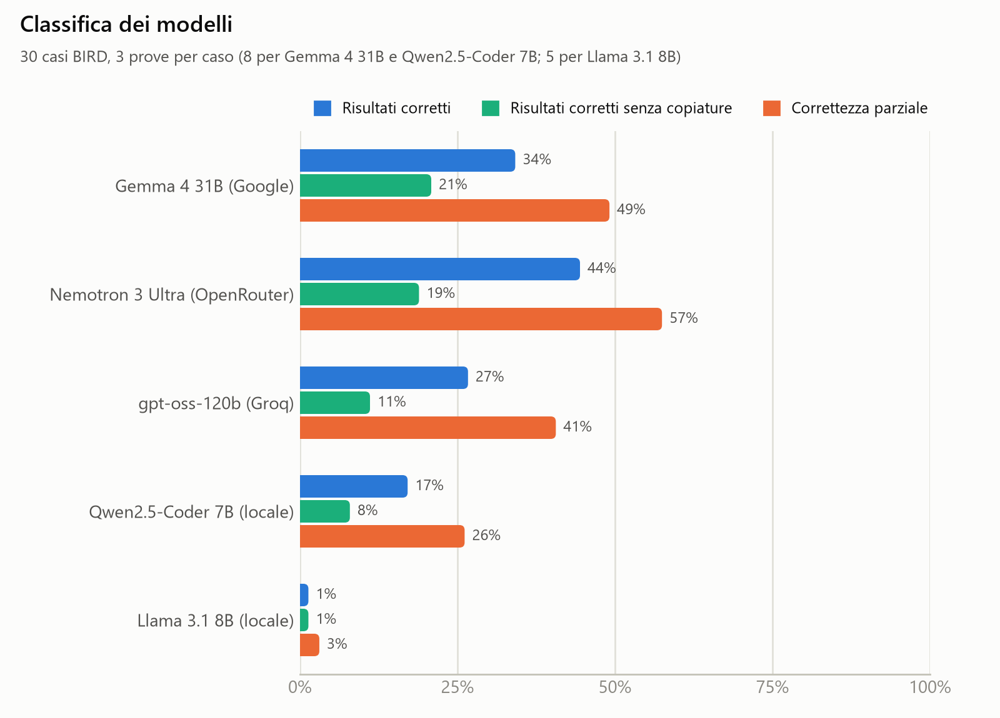

# Reverse engineering di trasformazioni SQL con modelli linguistici

L'idea del progetto è questa: do a un modello linguistico le tabelle di partenza di un database (che chiamo **Stato A**) e la tabella finale che si ottiene dopo una trasformazione (lo **Stato B**), senza dirgli a parole cosa è stato fatto, e gli chiedo di ricostruire la query SQL che porta da A a B. In pratica il modello deve fare "ingegneria inversa" sui dati.

All'inizio ho provato questa idea su un solo caso inventato da me (i prezzi di alcuni PC venduti in valute diverse, descritto in fondo alla pagina). Poi, per avere dei risultati più solidi, l'ho trasformata in un vero benchmark: ho preso 30 esempi reali dal dataset [BIRD](https://bird-bench.github.io/), che è uno dei dataset più usati per valutare i modelli sull'SQL, e ho messo a confronto 5 modelli diversi.

## I risultati

| Posizione | Modello | Risultati corretti senza copiature | Risultati corretti | Correttezza parziale | Prove |
|---|---|---|---|---|---|
| 1 | Gemma 4 31B (Google) | **20,8%** | 34,2% | 49,1% | 240 |
| 2 | Nemotron 3 Ultra (OpenRouter) | **18,9%** | 44,4% | 57,5% | 90 |
| 3 | gpt-oss-120b (Groq) | **11,1%** | 26,7% | 40,6% | 90 |
| 4 | Qwen2.5-Coder 7B (in locale) | **7,9%** | 17,1% | 26,1% | 240 |
| 5 | Llama 3.1 8B (in locale) | **1,3%** | 1,3% | 3,1% | 150 |

La classifica è ordinata secondo la misura più severa, cioè i risultati corretti senza copiature.



Per giudicare le risposte dei modelli ho usato tre misure, dalla più permissiva alla più severa:

- **Risultati corretti**: eseguo la query scritta dal modello e controllo se il risultato è identico alla tabella finale, riga per riga (l'ordine delle righe non conta e sui numeri tollero piccole differenze di arrotondamento). È la stessa misura che usa BIRD, dove si chiama Execution Accuracy.
- **Risultati corretti senza copiature**: durante le prove mi sono accorto che alcuni modelli "barano". Siccome nel prompt la tabella finale si vede tutta, quando ha poche righe il modello a volte si limita a ricopiarne i valori a mano (per esempio scrive `SELECT 'Trent','Smith' UNION ALL ...` con i nomi presi dalla tabella finale) invece di capire la trasformazione. Sui dati originali il risultato torna, ma il modello non ha capito niente. Per scoprirlo rieseguo la query del modello e quella vera su 3 copie dei dati da cui ho tolto a caso il 30% delle righe: chi ha capito la trasformazione resta corretto, chi ha copiato no.
- **Correttezza parziale**: un voto parziale, utile quando il modello ci va vicino senza fare centro. Tiene conto sia delle righe giuste che il modello ha trovato, sia di quelle sbagliate che ha aggiunto (tecnicamente è il punteggio F1 calcolato sulle righe).

Le cose che mi hanno colpito di più sono queste:

- **Quasi tutti i modelli a volte copiano.** Nemotron è il modello con più risultati corretti (44%), ma meno della metà reggono il controllo sulle copiature, e togliendo quelle scende al secondo posto. Gemma invece è la più "onesta": circa 6 risultati corretti su 10 sono veri. Anche gpt-oss e Qwen copiano spesso.
- **Nemotron però ci va vicino più spesso degli altri:** ha la correttezza parziale più alta (57,5%) ed è quello che ha risolto almeno una volta più casi (19 su 30).
- **I modelli piccoli sul mio computer vanno molto peggio.** Qwen2.5-Coder, che è specializzato nel codice, se la cava meglio di Llama (17% di risultati corretti contro l'1%), ma tutti e due si bloccano spesso ripetendo la stessa cosa all'infinito.
- **Le velocità sono molto diverse.** gpt-oss su Groq risponde in pochi secondi (di solito in 6 secondi), mentre Gemma e Nemotron impiegano di solito circa 3 minuti per una risposta.
- **9 casi su 30 non li ha risolti nessun modello**, nemmeno una volta: sono quelli in cui la trasformazione è più difficile da indovinare guardando solo i dati.
- Il caso dei PC, da cui è partito il progetto, è riportato a parte nelle tabelle: l'ha risolto solo Gemma, una volta su 8.

Le tabelle complete sono in [classifica/classifica.md](classifica/classifica.md), il dettaglio caso per caso in [classifica/dettaglio_casi.csv](classifica/dettaglio_casi.csv). Ho preparato anche altri tre grafici: [com'è finita ogni prova](classifica/fig_esiti.png), [quali casi ha risolto ogni modello](classifica/fig_casi.png) e [quanto tempo impiega ogni modello a rispondere](classifica/fig_tempi.png).

## I modelli che ho usato

Ho scelto solo modelli utilizzabili gratuitamente:

- **Llama 3.1 8B** e **Qwen2.5-Coder 7B**, che girano direttamente sul mio computer tramite Ollama. La mia scheda video ha solo 4 GB di memoria, quindi posso usare solo modelli piccoli, e sono anche lenti: per una risposta lunga Llama può impiegare più di 10 minuti.
- **Nemotron 3 Ultra** tramite OpenRouter, **Gemma 4 31B** tramite le API di Google e **gpt-oss-120b** tramite Groq, che sono modelli molto più grandi e girano sui server dei rispettivi fornitori.

Ogni caso l'ho fatto risolvere più volte a ogni modello (8 volte a Gemma e Qwen, 5 a Llama, 3 a Nemotron e gpt-oss; il perché lo spiego nei limiti in fondo), per un totale di 837 prove (810 sui casi di BIRD e 27 sul caso dei PC) prove fatte tra il 29 settembre e il 1 ottobre 2026.

## Come è organizzato il codice

- `estrazione_casi_BIRD.py` sceglie i 30 esempi da BIRD, esegue la query vera e salva ogni caso come file `.sqlite` con dentro lo Stato A e lo Stato B. Ho tenuto solo esempi semplici, con al massimo due tabelle di partenza e senza risultati fatti da un solo numero (da un solo numero non si può capire quale filtro è stato applicato). I criteri sono spiegati meglio in [casi_BIRD/README.md](casi_BIRD/README.md).
- `codice_verifica_casi_BIRD.py` controlla che i casi salvati siano identici all'originale di BIRD.
- `codice_benchmark.py` è il cuore del progetto: per ogni caso e ogni modello manda il prompt, esegue l'SQL che riceve indietro, lo valuta e salva il risultato in `risultati_benchmark/` (un file per ogni prova). Se si interrompe riparte da dove era rimasto.
- `controllo_copiatura.py` fa il controllo sui dati modificati descritto sopra, senza richiamare i modelli.
- `codice_classifica.py` raccoglie tutti i risultati e crea la classifica, le tabelle e i grafici nella cartella `classifica/`.
- `funzioni_comuni.py` contiene le parti usate da tutti gli script: il prompt, l'estrazione dell'SQL dalla risposta del modello, l'esecuzione e la valutazione. `test_valutazione.py` controlla che la valutazione funzioni su casi di cui conosco già il risultato.
- `ricalcolo_valutazioni.py` ricalcola la valutazione dei risultati già salvati, utile se si cambia il modo di valutare senza dover rifare tutte le prove.

Lavorando con i servizi gratuiti ho dovuto gestire parecchi imprevisti: server sovraccarichi, errori interni dei fornitori, limiti al numero di richieste giornaliere. Il programma riprova fino a 5 volte aspettando sempre di più, e se il problema è del server (e non del modello) rimanda la prova a più tardi invece di contarla come un errore del modello.

## Istruzioni per rifare il benchmark

1. Installare Python 3 e le librerie necessarie:
    ```bash
    pip install -r requirements.txt
    ```
2. Scaricare BIRD Mini-Dev nella cartella `bird-mini-dev/` (le istruzioni sono in [casi_BIRD/README.md](casi_BIRD/README.md)) e creare i casi:
    ```bash
    python estrazione_casi_BIRD.py
    python codice_verifica_casi_BIRD.py
    ```
3. Per i modelli in locale: installare [Ollama](https://ollama.com/) e scaricare i modelli con `ollama pull llama3.1` e `ollama pull qwen2.5-coder:7b`.
4. Per i modelli in cloud: creare le chiavi gratuite su OpenRouter, Groq e Google AI Studio e salvarle come variabili d'ambiente, senza scriverle nel codice. Su Windows, da PowerShell:
    ```bash
    setx OPENROUTER_API_KEY "la-propria-chiave"
    setx GROQ_API_KEY "la-propria-chiave"
    setx GOOGLE_API_KEY "la-propria-chiave"
    ```
    e poi riaprire il terminale.
5. Lanciare il benchmark, poi il controllo sulle copiature e infine la classifica:
    ```bash
    python codice_benchmark.py
    python controllo_copiatura.py
    python codice_classifica.py
    ```
    Con `--modelli` si può far girare solo alcuni modelli (io ho lanciato un processo per ogni fornitore, così un servizio lento non blocca gli altri) e con `--parte 1/2` e `--parte 2/2` si può dividere un modello lento in due processi paralleli.

## Limiti

- **Numero di prove diverso tra i modelli.** Ho usato solo servizi gratuiti, che hanno limiti diversi: con alcuni potevo fare molte prove, con altri poche al giorno. Per questo ho ripetuto ogni caso 8 volte con Gemma e Qwen, 5 con Llama e 3 con Nemotron e gpt-oss. Le percentuali sono sempre calcolate sulle prove di ciascun modello.
- **Le risposte cambiano da una prova all'altra.** Anche chiedendo ai modelli di essere il più possibile ripetibili (temperatura 0), la stessa domanda può dare risposte diverse: per questo ogni caso è ripetuto più volte.
- **Pochi casi e tutti semplici.** 30 casi sono un campione piccolo, quindi una differenza di pochi punti percentuali tra due modelli non va presa come una vera differenza.
- **Più trasformazioni possono essere giuste.** Senza la domanda a parole, in alcuni casi esistono più query diverse che danno lo stesso risultato sui dati (per esempio filtrare per diagnosi invece che per ID del paziente). Il confronto sui risultati le considera tutte corrette.
- **Il controllo sulle copiature non vale per tutti i casi.** In 4 casi togliere delle righe non cambia mai il risultato vero, quindi lì una copiatura non si può scoprire e un risultato corretto viene tenuto valido.
- **I modelli locali a volte si bloccano.** Capita che ripetano la stessa cosa all'infinito: in quel caso taglio la risposta dopo circa 3000 token e la prova conta come sbagliata (è successo in 48 prove su 150 con Llama e in 41 su 240 con Qwen).
- **I modelli in cloud cambiano nel tempo.** I fornitori li aggiornano senza avvisare: i risultati si riferiscono alle versioni disponibili tra il 29 settembre e il 1 ottobre 2026.

---

## L'esperimento iniziale

Qui sotto lascio la descrizione dei primi esperimenti, fatti prima del benchmark.

I file che contengono la parola "python" nel nome sono gli script con il codice vero e proprio, mentre i file e le cartelle nominati "Risultato" contengono le stampe di ciò che esce sulla console (PowerShell) quando faccio eseguire il programma. 

Ho diviso i test in due categorie principali per valutare le prestazioni:

Test in locale: Ho fatto girare i modelli direttamente sul mio computer. Poiché la mia macchina ha una potenza di calcolo limitata, i modelli utilizzati sono più leggeri e faticano parecchio. Di conseguenza, i risultati sono meno accurati, spesso presentano degli errori e tendono a ignorare o non rispettare del tutto le regole logiche che gli impongo nel prompt.

Test in Cloud (tramite OpenRouter): Qui ho potuto testare modelli molto più potenti, nello specifico Nemotron e Gemma, ottenendo un'accuratezza decisamente superiore. Nemotron è estremamente preciso nelle risposte, ma ha il difetto di impiegare tantissimo tempo per elaborare il risultato e molto spesso restituisce un errore perché i server si sovraccaricano. Gemma, invece, è molto più stabile e veloce (ha pochissimi errori di server), ma pecca un po' in precisione e ogni tanto commette qualche sbaglio nei ragionamenti.

Noterà leggendo il codice che i prompt che invio ai modelli sono pieni di clausole e regole molto rigide. Questo perché, utilizzando versioni gratuite delle intelligenze artificiali, c'è un alto rischio di "allucinazioni", quindi bisogna essere estremamente restrittivi per tenerli in carreggiata e guidare i loro ragionamenti.

Infine, noterà una cartella chiamata "progetto alternativo". Qui l'approccio logico è quello simile a BIRD: invece di fornire al modello la Tabella A e la Tabella B e farci restituire cosa è successo nel mezzo, gli fornisco solo la Tabella A (insieme a qualche eventuale tabella intermedia). Dopodiché, gli fornisco la struttura della Tabella B finale e lascio che sia lui a calcolarsi i dati per costruirla da zero (anche qui ho fatto le stesse cose dei modelli in locale, OpenRouter e Gemini e succede la stessa cosa, quello in locale spesso commette allucinazioni e quelli sul cloud ci mettono tanto a rispondere e danno problemi di collegamento)

### Istruzioni di Utilizzo

Per testare il framework seguire i passaggi sottostanti.

#### 1. Prerequisiti di Sistema
*   Assicurarsi di avere **Python 3** installato nel proprio ambiente.
*   Installare la libreria client di OpenAI:
    ```bash
    pip install openai
    ```
*   Il sistema utilizza `sqlite3`, già integrato nativamente in Python. Per utilizzare database relazionali differenti (es. PostgreSQL, MySQL), sarà necessario adattare le librerie di connessione e sostituire le query di sistema specifiche (come `sqlite_master`).

#### 2. Configurazione dei Modelli
*   **Esecuzione in Locale (Ollama):** Scaricare [Ollama](https://ollama.com/), avviarlo in background e scaricare il modello desiderato dal terminale (es. `ollama pull qwen2.5` o `ollama pull llama3.1`).
*   **Esecuzione in Cloud (OpenRouter/Groq):** Aprire lo script Python desiderato, individuare il blocco di configurazione del client `OpenAI` e inserire la propria **API Key** personale.

Per analizzare il proprio database:
1.  **Connessione:** Nello script, sostituire la connessione temporanea (es. `sqlite3.connect(':memory:')`) con il percorso al file del proprio database fisico:
    ```python
    conn = sqlite3.connect('percorso/del/proprio/database.db')
    ```
2.  **Selezione delle Tabelle:** Individuare le variabili di input e inserire i nomi esatti delle tabelle su cui si intende eseguire l'analisi:
    ```python
    # Inserire qui le tabelle di partenza per l'estrazione
    NOMI_TABELLE_SORGENTE = ('NOME_TABELLA_A', 'NOME_TABELLA_B') 
    
    # Inserire qui la tabella finale da dedurre o ricostruire
    NOME_TABELLA_TARGET = 'NOME_TABELLA_FINALE' 
    ```
    
#### 3. Esecuzione
Lanciare lo script dal terminale o da PowerShell:
```bash
python nome_dello_script.py 
```
